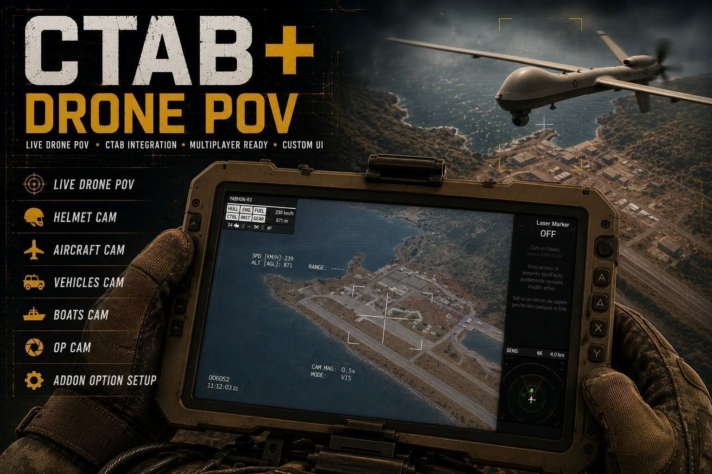
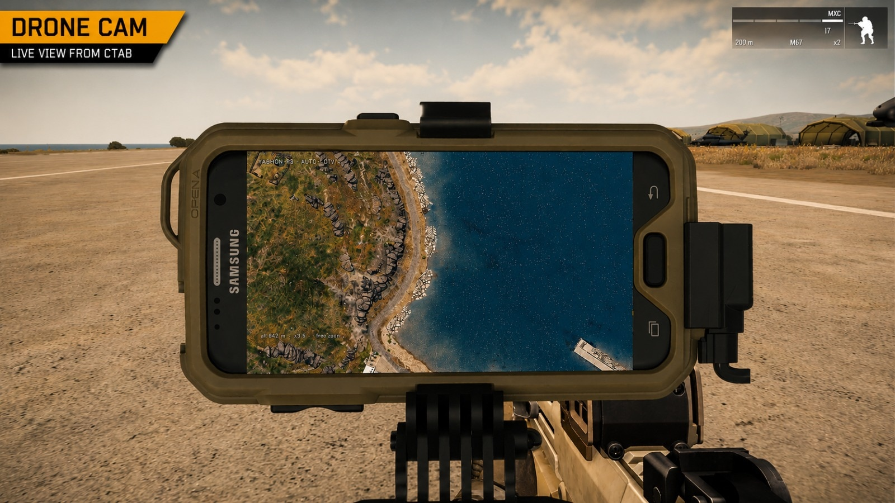
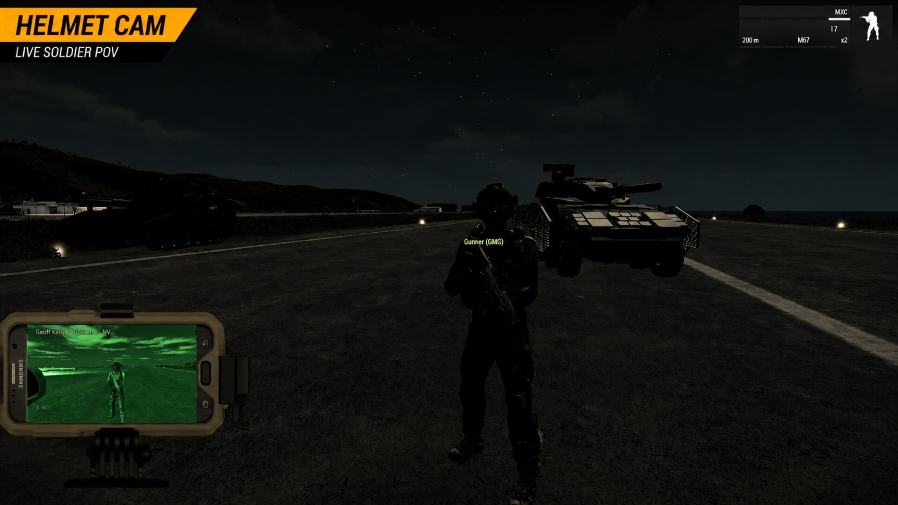
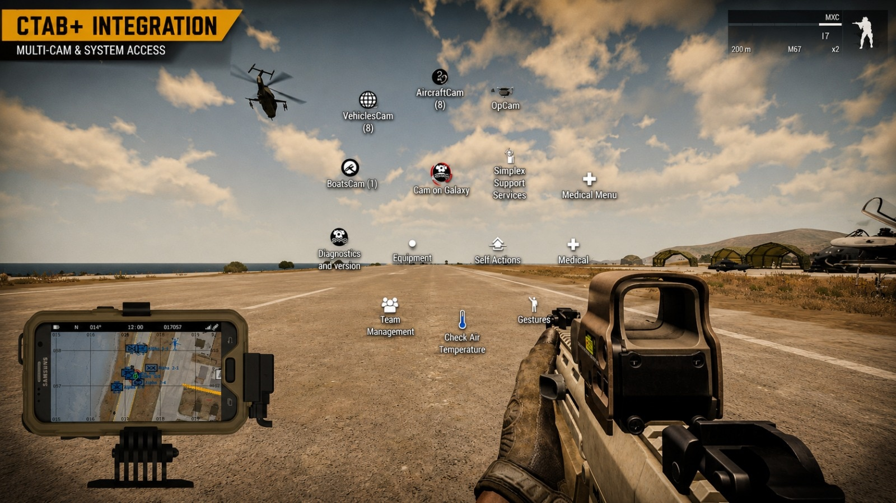

# cTab CruTeK



Una build modificata di **cTab** per ARMA 3. Aggiunge *Cam on Galaxy*: video in diretta da telecamere da casco, torrette, mezzi e droni, disegnato **dentro lo schermo del Samsung Galaxy** in render-to-texture, sia sul telefono aperto sia su quello piccolo sempre a schermo.

Non è un mod a parte: **sostituisce cTab**. Non caricarli tutti e due.

---

## Indice

- [Cosa aggiunge](#cosa-aggiunge)
- [Requisiti](#requisiti)
- [Installazione](#installazione)
- [Come si usa](#come-si-usa)
  - [Cosa devi portarti dietro](#cosa-devi-portarti-dietro)
  - [Il menu](#il-menu)
  - [Comandi](#comandi)
- [Impostazioni](#impostazioni)
  - [cTab-Cam on Galaxy](#ctab-cam-on-galaxy)
  - [cTab-Droni](#ctab-droni)
  - [cTab-HelmetCam](#ctab-helmetcam)
  - [cTab Compatibility MOD](#ctab-compatibility-mod)
- [Diagnostica](#diagnostica)
- [Note tecniche](#note-tecniche)
- [Crediti](#crediti)

---

## Cosa aggiunge

Sopra al cTab di serie:

- **Cam on Galaxy** — un ramo del menu ACE per collegare il Galaxy a una sorgente video e guardarla sullo schermo del telefono
- **Sorgenti**: telecamere da casco degli operatori, e torrette di aerei, elicotteri, droni, cingolati, ruotati e mezzi navali
- **Una voce per postazione occupata**: su un mezzo con più di una torretta presidiata scegli il posto, artigliere o comandante, e il comandante non deve per forza essere armato
- **Due forme di menu**: l'albero completo, oppure una forma breve che mette ogni sorgente disponibile a un clic solo
- **Brandeggio della torretta** sui droni senza operatore, direttamente dal video
- **Zoom a scatti** ripresi dai pod di puntamento veri
- **Permessi per fazione, categoria di mezzo e tipo di occupante**, tutti nelle opzioni degli addon, quindi impostabili per missione
- **Profili di compatibilità per mod**, così i mezzi dei mod che non seguono le convenzioni di serie vengono dichiarati invece che indovinati
- Le finestre video di cTab (drone e telecamera da casco) passano da un render target 512 a **1024**

Tutto il resto di cTab — tablet, mappa, marker, MicroDAGR — funziona come lo conosci.



*Il feed di un drone dentro lo schermo del telefono, con sorgente, quota, zoom e modo sovraimpressi.*

---

## Requisiti

| Mod | Serve |
|---|---|
| **CBA_A3** | sì |
| **ACE3** | sì, il menu è un'autointerazione ACE |

Il **PiP** deve essere acceso nelle opzioni video di ogni giocatore: è quello che disegna il feed dentro lo schermo del telefono. Col PiP spento lo schermo resta nero.

> Non caricare il cTab di serie insieme a questo. Il prefisso interno è sempre `cTab` e le classi hanno gli stessi nomi: insieme non convivono.

---

## Installazione

Come qualunque mod: una cartella `@cTab_CruTeK` che contiene `addons\cTab_CruTeK.pbo`, spuntata nel launcher al posto di cTab.

Gli oggetti non cambiano — `ItemcTab`, `ItemAndroid`, `ItemMicroDAGR`, `ItemcTabHCam` — quindi le missioni scritte per cTab continuano a funzionare senza toccarle.

---

## Come si usa

### Cosa devi portarti dietro

**Per guardare**: il **Samsung Galaxy** (`ItemAndroid`) in inventario. È lo schermo su cui esce il feed.

**Per essere guardati**:

| Sorgente | Cosa serve |
|---|---|
| Telecamera da casco | l'oggetto **`ItemcTabHCam`** addosso all'operatore |
| Torrette e droni | niente da portare: contano il mezzo, la sua fazione e chi c'è a bordo |

La classe dell'oggetto telecamera da casco si può cambiare nelle impostazioni, se ne usi un'altra.



*OpCam su un operatore con i visori notturni: in alto compaiono il nome di chi la porta, il modo e la distanza.*

### Il menu

Menu di **autointerazione ACE**, voce **Cam on Galaxy**. Compare solo se hai il Galaxy addosso.

```
Cam on Galaxy
├── OpCam                          telecamere da casco
├── AircraftCam
│   ├── Drone
│   ├── Plane
│   └── Heli
├── VehiclesCam
│   ├── Drone
│   ├── Tank
│   └── Car
├── BoatsCam
│   ├── Drone
│   └── Boat
├── Nascondi feed / Rimostra feed
├── Scollega
└── Diagnostica e versione
```

Sui mezzi terrestri e navali ogni voce si apre di un livello ancora, sulle postazioni occupate:

```
VehiclesCam
└── Tank
    └── Slammer TUSK  -  120 m  (2)
        ├── ROSSI  -  COMANDANTE
        └── BIANCHI  -  ARTIGLIERE
```

Ogni riga porta chi ci sta seduto e il ruolo, letto dal config del mezzo: è la dicitura del gioco e arriva già tradotta. Una postazione compare se è occupata e dichiara un punto ottica del cannoniere; **non** serve che sia armata, ed è questo che rende guardabile il posto comandante. Droni e aerei restano un livello sopra: la loro sorgente è il pod o i memory point camera, quindi non c'è nessun posto da scegliere.

Se seguire quell'albero col mouse diventa scomodo, l'impostazione **Menu ACE** ha una forma **Breve** che lo richiude tutto in un elenco solo:

```
Cam on Galaxy
├── OpCam  (2)
├── Disponibili  (4)
│   ├── ANDERSON  -  OPERATORE MK41 VLS  -  Mk41 VLS  -  671 m
│   ├── BIANCHI  -  ARTIGLIERE  -  Slammer TUSK  -  120 m
│   ├── UGV Stomper  -  143 m
│   └── Drone  -  Sentinel  -  890 m
├── Nascondi feed
├── Scollega
└── Diagnostica e versione
```

Saltate sia le categorie sia i rami per tipo di mezzo, il nome del mezzo si sposta dentro la riga, e ogni sorgente sta a un clic da Cam on Galaxy. Le telecamere da casco tengono il loro ramo OpCam in tutte e due le forme.

I rami e le categorie vuote non vengono disegnati: se in giro non ci sono elicotteri, il ramo Heli non compare. In lista entrano solo i mezzi ammessi dalle impostazioni.

I droni hanno una voce loro dentro ogni ambiente, e non è un vezzo: sono gli unici di cui puoi brandeggiare la torretta.



*Ogni ramo porta scritto quante sorgenti sono disponibili in quel momento, così sai se vale la pena aprirlo prima di aprirlo.*

### Comandi

Sempre attivi, niente da assegnare:

| Comando | Effetto |
|---|---|
| Tasto destro tenuto sul video | brandeggia la torretta — solo droni senza operatore, solo a telefono aperto |
| `Maiusc` + rotella | operatore successivo / precedente — solo OpCam |
| `Maiusc` + clic rotella | nasconde il video e torna alla mappa |

Assegnati di serie e riassegnabili dalla sezione **cTab Camera** dei comandi CBA:

| Tasto | Effetto |
|---|---|
| `Maiusc` + freccia destra / sinistra | filtro visivo successivo / precedente |
| `Maiusc` + `Fine` | nasconde il video |
| `Maiusc` + `Canc` | scollega |

Registrati nella stessa sezione ma **senza nessun tasto di serie**, mettiteli tu se li vuoi: operatore successivo, operatore precedente, brandeggio torretta.

Una seconda sezione, **cTab Samsung Position**, sposta il telefonino piccolo sempre a schermo. Serve l'opzione *Overlay position Samsung* accesa nelle opzioni degli addon:

| Tasto | Effetto |
|---|---|
| `Ctrl` + `Alt` + freccia sinistra | telefono a sinistra |
| `Ctrl` + `Alt` + freccia giù | telefono al centro |
| `Ctrl` + `Alt` + freccia destra | telefono a destra |

> Quelle tre combinazioni ricentrano anche la camera del feed, quindi col feed acceso fanno due cose insieme. Se ti dà fastidio, riassegnale.

I comandi del feed rispondono **solo mentre un feed è acceso**. Senza feed la combinazione passa oltre e non ruba niente agli altri mod.

---

## Impostazioni

Sta tutto nelle **opzioni degli addon**, in quattro categorie separate. Sono impostazioni di missione, quindi si settano una volta per scenario dall'editor.

### cTab-Cam on Galaxy

Vale per i mezzi con equipaggio.

**Fazioni osservabili** — propria, BLUFOR, OPFOR, Indipendenti, Civili. Di serie: propria, BLUFOR e Civili.

**Categorie di mezzi** — aria, terra, mare. Tutte accese.

**Trasmetti solo posto Artigliere o Comandante per veicoli anfibi o terrestri** — accesa di serie. Conta solo chi è seduto in una torretta: autista e passeggeri no. Un mezzo col solo autista ha la torretta dove l'hanno lasciata, e il feed inquadra il nulla. Togliendo la spunta il menu elenca tutti i posti disponibili nel mezzo, rispettando la regola qui sotto. I mezzi che volano non sono mai toccati.

**Chi deve essere a bordo** — quattro valori, il primo è quello di serie:

| Valore | Significato |
|---|---|
| player o IA | va bene chiunque |
| solo player | a bordo ci deve essere un giocatore |
| solo IA | a bordo ci deve essere un'IA |
| anche mezzi vuoti | nessun controllo |

> "Anche mezzi vuoti" non è il valore di serie per un motivo: la torretta di un mezzo vuoto sta dove l'hanno lasciata, e il feed inquadra il nulla.

**Limiti di gioco** — distanza massima dalla sorgente (4000 m), quota minima, e una distanza di visuale minima mentre un feed è acceso.

> La quota minima è una **soglia secca** e di serie vale `0`. Un aereo fermo in pista misura qualche centimetro *sotto* zero, perché l'origine del modello sta sotto il punto di contatto del carrello: al valore di serie, finché è a terra, in lista non entra mai. Se vuoi vedere anche gli aerei fermi mettila negativa, `-10` basta e avanza.

> La distanza di visuale è un **unico valore globale** per tutto il disegno: alzarla per il feed alza anche la tua visuale vera mentre il feed è aperto. Di serie è `0`, cioè il mod non la tocca. Se ti serve, la strada pulita è alzare il valore ACE a chi fa da operatore drone.

**Menu ACE** — **Normale**, quella di serie, oppure **Breve**. Normale è l'albero mostrato sopra. Breve mette tutte le sorgenti sotto un'unica voce *Disponibili*, a un clic da Cam on Galaxy. Esiste perché il menu di autointerazione ACE si apre a raggiera: più l'albero è profondo, più i rami finiscono lontani dal cursore, e in una missione affollata l'ultimo livello si richiudeva prima che il mouse ci arrivasse.

### cTab-Droni

Categoria a sé, perché su un drone la questione dell'equipaggio non vuol dire niente: **chi comanda un drone sta al terminale, non a bordo**. L'equipaggio di un drone è sempre IA, anche mentre lo stai pilotando tu.

- interruttore generale della categoria droni
- fazioni sue, indipendenti da quelle dei mezzi
- **chi comanda il drone**: player o IA, solo player, solo IA — legge chi è collegato al terminale
- distanza massima sua (6000 m)
- brandeggio della torretta acceso o spento

### cTab-HelmetCam

- interruttore generale
- **classe dell'oggetto** richiesto, `ItemcTabHCam` di serie
- distanza massima (2000 m)
- **chi porta la telecamera**: player o IA, solo player, solo IA
- fazioni sue

### cTab Compatibility MOD

Certi mod non seguono le convenzioni di Bohemia, e per i loro mezzi le regole generiche non bastano. Questa categoria contiene **un profilo per mod**, ognuno accendibile e spegnibile per conto suo, così allargare le regole dove serve non cambia il comportamento dei mezzi di serie.

Sezione **Mod di aerei e mezzi**:

| Impostazione | Di serie | Copre |
|---|---|---|
| **USAF Mod** | accesa | compatibilità torrette per gli aerei USAF |

Cosa cambia il profilo USAF, e solo sui mezzi USAF:

- **AC-130U** — al telefono si collegano solo le postazioni **IR Operator**, **TV Operator** ed **Electronic Warfare Officer**. Il pod del pilota non viene offerto come sorgente: su un cannoniere la vista che serve è quella del sensore, non quella della cabina.
- **Puntamento sulle postazioni che ruotano per animazione** invece che muovendo la canna di un'arma. Su questi velivoli la palla sensore gira mentre le volate restano fisse alla fusoliera, quindi leggere la direzione dall'arma lasciava l'immagine ferma per quanto si brandeggiasse.
- **Riconoscimento dell'operatore sui mezzi con più di una torretta.** Il controllo di serie guarda solo il cannoniere primario e il pilota, quindi un giocatore seduto a qualunque altra postazione conta come nessuno, e termiche e zoom non vengono mai rispecchiati.
- **A-10, F-35, MQ-9 e RQ-4A** sono dichiarati esplicitamente e tengono le sorgenti che usavano già. Per loro non cambia niente.

Spegnila se il mod USAF non è caricato, o se una sua versione futura smette di aver bisogno del profilo.

---

## Diagnostica

All'avvio, nel `.rpt`:

```
[crutek_dcam] versione 2026-08-04-p3
[crutek_dcam] impostazioni registrate: cTab-Cam on Galaxy e cTab-HelmetCam
```

Se la prima riga manca, il modulo non è partito. In gioco, la voce **Diagnostica e versione** in fondo al menu stampa a schermo versione e stato corrente.

### Se qualcosa non va

| Sintomo | Cosa controllare |
|---|---|
| il menu Cam on Galaxy non compare mai | hai il Galaxy addosso (`ItemAndroid`)? ACE è caricato? |
| schermo del telefono nero | il PiP è acceso nelle opzioni video? |
| un mezzo manca dalla lista | la sua fazione è ammessa? la categoria è accesa? è entro la distanza massima? soddisfa la regola su chi deve essere a bordo? |
| un aereo fermo a terra non compare | la quota minima è una soglia secca e un aereo a terra misura appena sotto zero. Mettila negativa |
| manca un operatore | porta l'`ItemcTabHCam`? la sua fazione è fra quelle osservabili in cTab-HelmetCam? |
| un mezzo di un mod mostra la camera sbagliata, o nessuna | il suo profilo è acceso in cTab Compatibility MOD? un mod senza profilo ricade sulle regole generiche |
| manca un posto dall'elenco delle postazioni | c'è qualcuno seduto? quella torretta dichiara un punto ottica del cannoniere? senza, la camera non saprebbe dove stare |
| il tasto destro non brandeggia | funziona solo sui droni **senza operatore** e a telefono aperto, e il brandeggio va acceso in cTab-Droni |
| immagine sgranata | è l'impostazione video del PiP, ed è per giocatore |

---

## Note tecniche

**Il feed riempie tutto lo schermo del telefono.** Niente bande laterali, anche al costo di inquadrare più largo di quanto farebbe l'ottica vera.

**Lo zoom dell'operatore è il limite.** Quando ti colleghi parti da dove sta guardando lui, e da lì puoi solo stringere: allargare oltre il suo campo visivo non si può. Gli scatti vengono dai pod di puntamento veri. Vale anche sui mezzi terrestri e navali: chi siede in una torretta pubblica cosa sta guardando, quindi il suo zoom e la sua termica arrivano al telefono.

**Il puntamento viene dalla torretta, non dalla canna.** Una postazione si punta con le sue sorgenti di animazione, azimut del corpo ed elevazione del pezzo, perché quelle *sono* dove guarda l'ottica. Leggere la direzione dall'arma funziona solo dove volata e ottica coincidono: su un carro succede, su parecchi altri mezzi no, e lì l'immagine restava ferma mentre l'artigliere brandeggiava. L'arma resta il ripiego per le torrette che le sorgenti non le dichiarano.

**Non tutte le armi sanno puntare.** Lanciafumogeni, contromisure, illuminanti, designatori laser e clacson vengono scartati prima di usare qualcosa come riferimento di puntamento. Un lanciafumogeni imbullonato allo scafo bastava a inchiodare la vista di un comandante, perché la sua sola presenza vinceva sulle sorgenti di animazione.

**Termiche vanilla.** Il mod non dipende da A3TI e non ne riproduce la resa: A3TI lavora con effetti disegnati sullo schermo del giocatore, e uno schermo dentro un render target non ci entra.

**I profili di compatibilità sono dichiarazioni, non deduzioni.** Ogni mod ha la sua cartella sotto `comp_mod`, e dentro una tabella che dice quali postazioni di quali famiglie di mezzi si possono guardare, e dove guardare quando nessuna di quelle è disponibile — il pod del pilota, i memory point camera del mezzo, o da nessuna parte. Un mezzo elencato che non ha nessuna sorgente utilizzabile viene **tolto dal menu** invece di ripiegare su qualcosa a caso, e un mezzo che nessuna tabella nomina non viene toccato affatto.

**Aprire l'arsenal scollega il feed.** Sia quello ACE sia quello vanilla: aprire l'arsenal con un feed acceso lo chiude, invece di lasciarlo appeso.

**Comandi CBA e profilo.** CBA lega i tasti al nome interno dell'azione e li scrive nel profilo alla prima registrazione: da lì in poi il valore di serie scritto nel codice non conta più, vince quello salvato. È la stessa proprietà che fa sopravvivere le riassegnazioni dei giocatori. Per questo il prefisso dei nomi porta una versione: cambiala e CBA vede azioni nuove, che ripartono dal valore di serie. Toccala solo quando cambi i tasti predefiniti, sapendo che azzera le riassegnazioni fatte dai giocatori.

---

## Crediti

Basato su **cTab** di Gundy e collaboratori. Le modifiche di questa build sono di **CruTeK / ArTeK**.

Segnalazioni e idee sono benvenute: [github.com/sarteko](https://github.com/sarteko)
